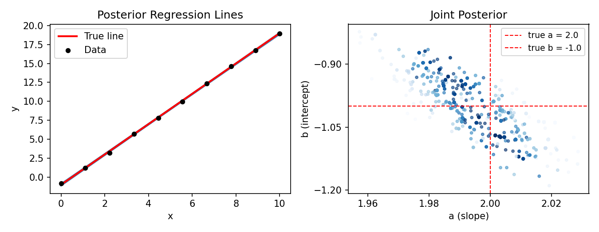
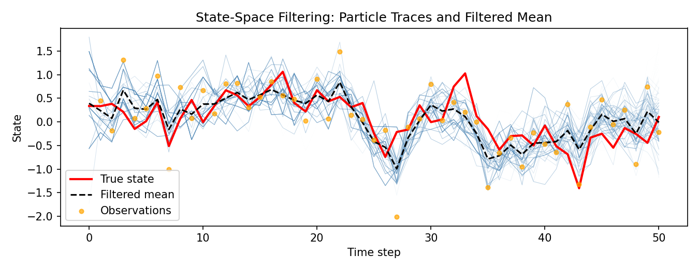

# WeightedSampling.torch

[](https://github.com/mariusfurter/WeightedSampling.torch/actions/workflows/test.yml)
[](LICENSE)
[](https://www.python.org/)

A lightweight probabilistic programming library for **Sequential Monte Carlo** in PyTorch.

Models are defined as standard Python functions using the `@model` decorator. All particles execute the model simultaneously through PyTorch broadcasting, requiring no manual loops or specialized syntax. The library provides SMC inference with adaptive resampling, Metropolis-Hastings rejuvenation moves, and automatic marginal likelihood estimation.

> Also available in Julia: [WeightedSampling.jl](https://github.com/MariusFurter/WeightedSampling.jl)

## Installation

```bash
pip install git+https://github.com/mariusfurter/WeightedSampling.torch.git
```

Requires Python ≥ 3.8 and PyTorch ≥ 1.10.

## Quick Start

### Bayesian Linear Regression with MH Moves

Infer slope and intercept from noisy data, using MCMC moves after each observation to maintain particle diversity.

```python
import torch
import torch.distributions as dist
from weighted_sampling import model, sample, observe, move, summary
from weighted_sampling import RandomWalkProposal

@model
def linear_regression(data):
    a = sample("a", dist.Normal(0, 5))
    b = sample("b", dist.Normal(0, 5))
    for x, y in data:
        observe(y, dist.Normal(a * x + b, 0.1))
        move(["a", "b"], RandomWalkProposal(scale=0.1), threshold=0.5)

# Generate synthetic data: y = 2x - 1 + noise
torch.manual_seed(0)
xs = torch.linspace(0, 10, 10)
ys = 2.0 * xs - 1.0 + 0.1 * torch.randn(10)
data = list(zip(xs, ys))

result = linear_regression(data, num_particles=1000, ess_threshold=0.5)
stats = summary(result)
print(f"a: {stats['a']['mean']:.3f} ± {stats['a']['std']:.3f}")  # ≈ 2.0
print(f"b: {stats['b']['mean']:.3f} ± {stats['b']['std']:.3f}")  # ≈ -1.0
```



Full example with plotting: [examples/linear_regression.py](examples/linear_regression.py)

### State-Space Filtering

Track a latent AR(1) state through noisy observations. Resampling triggers automatically when the effective sample size drops.

```python
from weighted_sampling import model, sample, observe, expectation

@model
def state_space_model(observations):
    x = sample("x_0", dist.Normal(0.0, 1.0))
    for t, y in enumerate(observations):
        x = sample(f"x_{t+1}", dist.Normal(0.8 * x, 0.5))
        observe(y, dist.Normal(x, 0.5))

result = state_space_model(observations, num_particles=1000)
print(f"Log evidence: {result.log_evidence:.2f}")
```



SMC computes the **marginal likelihood** $\hat{p}(\mathbf{y}_{1:T})$ as a byproduct of inference — useful for model comparison. On a linear-Gaussian model, this matches the exact Kalman filter solution (see [examples/verify_log_evidence.py](examples/verify_log_evidence.py)).

Full example with data generation and plotting: [examples/state_space_model.py](examples/state_space_model.py)

## Features

- **Vectorized execution** — all $N$ particles run the model simultaneously via PyTorch broadcasting. No Python loops over particles.
- **Adaptive resampling** — multinomial resampling triggers when ESS falls below a configurable threshold.
- **MH rejuvenation moves** — `RandomWalkProposal` and `AdaptiveProposal` (Adaptive Metropolis with particle-estimated covariance) combat particle degeneracy.
- **Importance sampling** — use `ImportanceSampler` to sample from a proposal different from the prior.
- **Discrete models** — `DiscreteConditional` provides lazy, memoized conditional probability tables for Bayesian networks.
- **Log evidence** — marginal likelihood $\hat{p}(\mathbf{y})$ computed automatically during inference.
- **Works with `torch.distributions`** — any standard PyTorch distribution works out of the box.

## More Examples

### Importance Sampling

Use a proposal distribution different from the target to improve sampling efficiency.

```python
from weighted_sampling import model, sample, expectation, ImportanceSampler
import torch.distributions as dist

@model
def importance_sampling_example():
    # Sample from Normal(0, 5) proposal, weight toward Normal(3, 1) target
    x = sample("x", ImportanceSampler(
        target=dist.Normal(3.0, 1.0),
        proposal=dist.Normal(0.0, 5.0),
    ))

result = importance_sampling_example(num_particles=10_000)
print(f"E[x] = {expectation(result, lambda x: x).item():.3f}")  # ≈ 3.0
```

### Discrete Bayesian Network

Define conditional probability tables for discrete variables.

```python
from weighted_sampling import model, sample, observe, summary, DiscreteConditional

cloudy_cpt = DiscreteConditional(lambda: [0.5, 0.5], domain_sizes=[])
rain_cpt = DiscreteConditional(
    lambda c: [0.2, 0.8] if c == 1 else [0.8, 0.2],
    domain_sizes=[2],
)
sprinkler_cpt = DiscreteConditional(
    lambda c: [0.9, 0.1] if c == 1 else [0.5, 0.5],
    domain_sizes=[2],
)
wet_grass_cpt = DiscreteConditional(
    lambda s, r: [0.01, 0.99] if s == 1 and r == 1
           else [0.1, 0.9]  if s == 1 or r == 1
           else [1.0, 0.0],
    domain_sizes=[2, 2],
)

@model
def wet_grass_model():
    c = sample("cloudy", cloudy_cpt())
    r = sample("rain", rain_cpt(c))
    s = sample("sprinkler", sprinkler_cpt(c))
    observe(torch.tensor(1), wet_grass_cpt(s, r))

result = wet_grass_model(num_particles=10_000)
stats = summary(result)
print(f"P(Rain | wet grass) ≈ {stats['rain']['mean']:.3f}")
```

## Analysis Utilities

`summary` returns weighted mean, standard deviation, and particle diversity for each variable:

```python
stats = summary(result)
print(stats["a"]["mean"], stats["a"]["std"], stats["a"]["n_unique"])
```

`expectation` computes $\mathbb{E}[f(\mathbf{x})]$ under the weighted posterior. The function signature determines which variables are passed:

```python
# E[a * b]
expectation(result, lambda a, b: a * b)

# E[x^2]
expectation(result, lambda x: x ** 2)
```

## API Note: Variable Names and Moves

When using `move`, the model is replayed internally to compute MH acceptance ratios. This requires that every `sample` site has a **unique name** within a single model execution. Reusing a name (e.g. `sample("x", ...); sample("x", ...)`) will raise a `ValueError`.

Sequential models naturally avoid this by indexing names: `sample(f"x_{t}", ...)`.

## Tests

```bash
pytest tests/ -v
```

## Contributing

See [CONTRIBUTING.md](CONTRIBUTING.md) for guidelines.

## License

MIT — see [LICENSE](LICENSE) for details.
